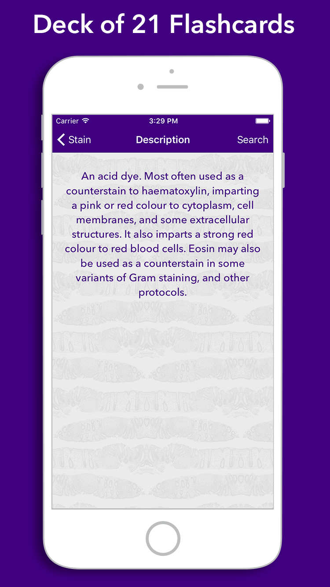
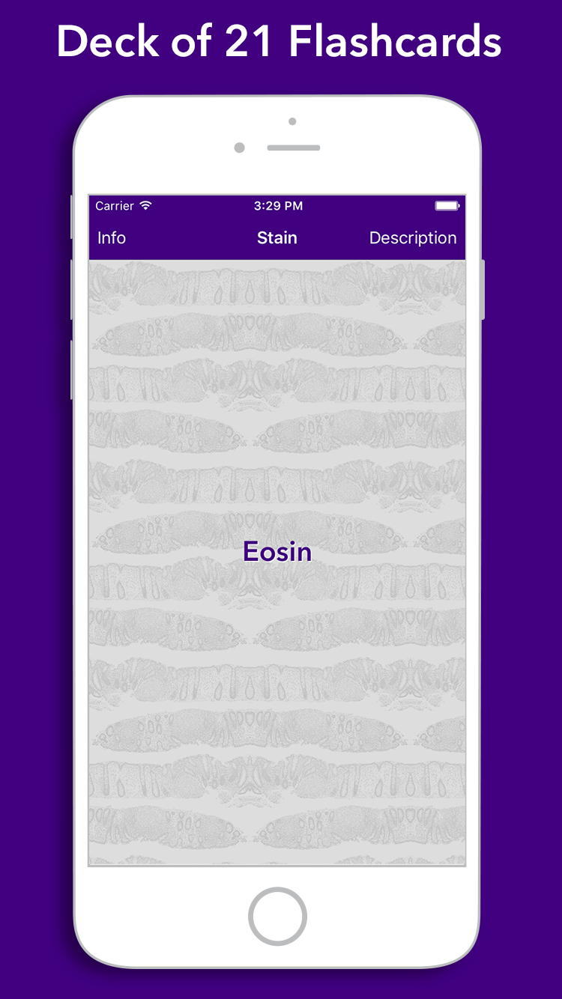
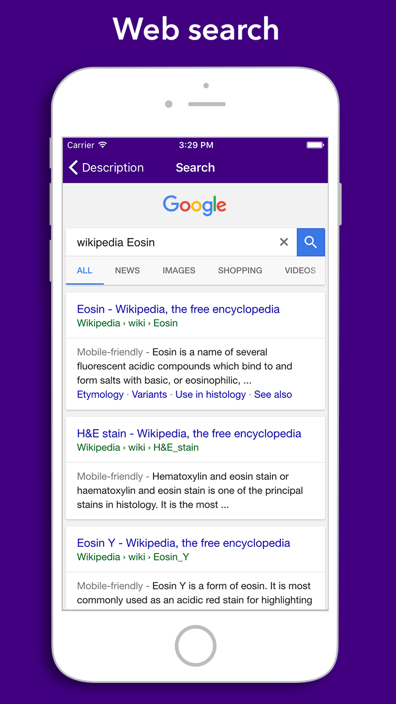

# flashkarte-histology-stains
A simple iOS Swift 3.x app that shows random histology stain flashcards.
I made this to learn about Swift app development. 
The basic app (before I modified the code) is based on the work of [Yong Bakos](http://yongbakos.com/)

